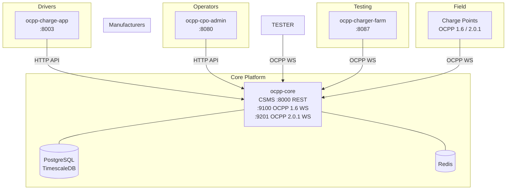

# OCPP Platform

> The first complete open source EV charging platform.

Everything you need to run a Charge Point Operator — from protocol to driver app. One `docker compose up` and you're live.

---

## The Stack

| Component | What | Port(s) |
|-----------|------|---------|
| [**ocpp-core**](https://github.com/opencpo/opencpo-core) | OCPP 1.6/2.0.1 CSMS backend | 9100 (WS 1.6), 9201 (WS 2.0.1), 8000 (REST) |
| [**ocpp-cpo-admin**](https://github.com/opencpo/opencpo-admin) | Network management dashboard | 8080 |
| [**ocpp-charge-app**](https://github.com/opencpo/opencpo-charge-app) | Driver-facing PWA | 8003 |
| [**ocpp-charger-farm**](https://github.com/opencpo/opencpo-charger-farm) | Virtual charger simulator | 8087 |

---

## Quick Start

The **one-liner** installs everything — no git, Python, or Docker needed:

```bash
curl -fsSL https://raw.githubusercontent.com/opencpo/opencpo/main/install.sh | bash
```

This will:
- Detect your OS (Ubuntu, Fedora, Arch, macOS)
- Install **Python 3** if missing
- Install **Docker + Compose** via the official script
- Clone all 5 component repos
- Run the configuration wizard
- Build all Docker images

> **Already have git?** Same result: `git clone https://github.com/opencpo/opencpo.git && cd opencpo && ./setup.sh`

When done, open **http://localhost:8080** — your CPO admin panel is ready.
```

Open **http://localhost:8080** — your CPO admin panel is ready.

> First run takes a few minutes to build images. Subsequent starts are instant.

---

## Architecture



---

## What Can You Do?

### As a CPO (Charge Point Operator)
- Deploy chargers with full OCPP 1.6 and 2.0.1 support
- Manage your entire network through the admin panel — chargers, sessions, faults
- Let drivers start charging via a PWA — no app store needed, just scan a QR
- Set tariffs per charger, manage RFID tokens, handle billing and reports
- Monitor your network in real time with live session data

### As a Charger Manufacturer
- Certify your chargers against the OCPP spec before shipping
- Get detailed compliance reports broken down by message type
- Build charger profiles that document known quirks for CPO compatibility
- Run automated regression testing as part of your firmware CI

### As a Developer
- Extend any component independently — each has its own plugin/skin/profile system
- Stress test your backend with virtual chargers (hundreds in parallel)
- Fork any component and build your own CPO business on top
- All APIs are open — integrate with billing systems, fleet management, energy management

---

## Components

### [ocpp-core](https://github.com/opencpo/opencpo-core)
The heart of the platform. A high-performance CSMS (Central System Management Server) that speaks OCPP 1.6 and 2.0.1 natively. Handles charger connections, session management, remote commands, smart charging profiles, and exposes a full REST API for the other services.

### [ocpp-cpo-admin](https://github.com/opencpo/opencpo-admin)
The operator's command centre. A React dashboard for managing your charging network end-to-end: charger health, live sessions, tariff configuration, RFID token management, PKI certificates, and analytics.

### [ocpp-charge-app](https://github.com/opencpo/opencpo-charge-app)
Driver-facing Progressive Web App. Scan a QR code → authorize → charge → pay. No app store. Works on any smartphone. Supports guest sessions, RFID-linked accounts, and real-time session status.

Automated charger certification. Point it at any charger, run the test suite, get a compliance report. Covers the full OCPP 1.6 and 2.0.1 message specification with configurable test profiles.

### [ocpp-charger-farm](https://github.com/opencpo/opencpo-charger-farm)
Virtual charger simulator and load tester. Spin up hundreds of simulated chargers, run stress tests, replay real-world session traces, and validate your backend under load before going live.

---

## Documentation

Each component has full docs in its `docs/` directory:

- `docs/getting-started.md` — component-specific setup
- `docs/api.md` — REST/WebSocket API reference
- `docs/configuration.md` — all environment variables
- `docs/architecture.md` — internals and extension points

---

## Repository Structure

```
opencpo/          ← you are here (orchestration only)
├── docker-compose.yml  ← spin up everything
├── setup.sh            ← clone all component repos
├── .env.example        ← configuration reference
├── README.md
├── CONTRIBUTING.md
├── LICENSE
│
├── ocpp-core/          ← cloned by setup.sh
├── ocpp-cpo-admin/     ← cloned by setup.sh
├── ocpp-charge-app/    ← cloned by setup.sh
└── ocpp-charger-farm/  ← cloned by setup.sh
```

> **This repo contains no application code.** It's pure orchestration — compose files, scripts, and docs. Each component lives in its own repo and is a git submodule or clone.

---

## Configuration

Copy `.env.example` to `.env` and adjust as needed. All defaults work for local development.

Key settings:

| Variable | Default | Description |
|----------|---------|-------------|
| `POSTGRES_PASSWORD` | `ocpp` | Database password (change in production!) |
| `ORG_NAME` | `My CPO` | Your organisation name shown in the UI |
| `PUBLIC_URL` | `http://localhost` | Public base URL for QR codes and deep links |
| `OCPP_16_WS_PORT` | `9100` | OCPP 1.6 WebSocket port |
| `OCPP_201_WS_PORT` | `9201` | OCPP 2.0.1 WebSocket port |

See `.env.example` for the full list.

---

## Production Deployment

For production, you'll want to:

1. Change all default passwords in `.env`
2. Put a reverse proxy (nginx/Caddy) in front with TLS
3. Use managed Postgres (RDS, Supabase, etc.) or enable TimescaleDB backups
4. Set `PUBLIC_URL` to your real domain
5. Configure SMTP for email notifications

See each component's `docs/deployment.md` for detailed production guidance.

---

## Community

- **💬 [Join our Discord](https://discord.gg/ra9pnygmrt)** — Real-time chat, support, showcase, and contributor discussions
- **🐛 [GitHub Issues](https://github.com/opencpo/opencpo/issues)** — Bug reports and feature requests
- **💡 [GitHub Discussions](https://github.com/opencpo/opencpo/discussions)** — Long-form conversations and RFCs

## Contributing

See [CONTRIBUTING.md](CONTRIBUTING.md) for how to get involved.

In short: fork the relevant component repo, make your changes, open a PR there. Changes to orchestration (compose, scripts) go here.

---

## License

Apache 2.0 — use it, modify it, build a business on it.

See [LICENSE](LICENSE).
